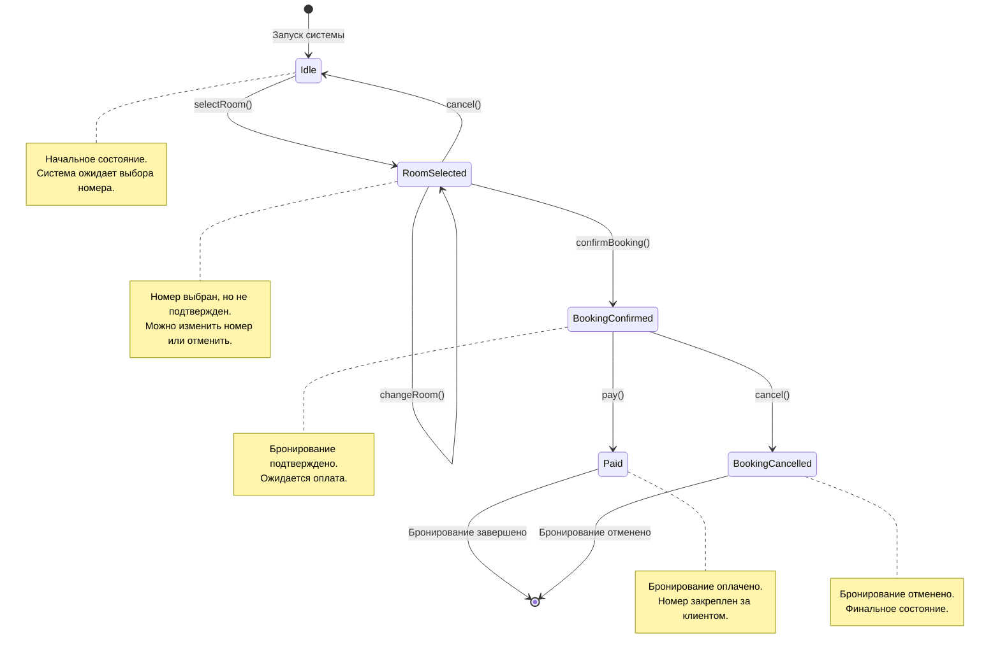

# Диаграмма состояний: Система бронирования номера в гостинице

## Описание состояний

| Состояние | Описание |
|-----------|----------|
| Idle | Начальное состояние. Система ожидает действия пользователя |
| RoomSelected | Пользователь выбрал номер, но не подтвердил бронирование |
| BookingConfirmed | Бронирование подтверждено, но не оплачено |
| Paid | Бронирование оплачено, номер закреплен за пользователем |
| BookingCancelled | Бронирование отменено |

## Переходы

| Из состояния | В состояние | Событие | Условие |
|--------------|-------------|---------|---------|
| Idle | RoomSelected | selectRoom() | Номер доступен |
| RoomSelected | Idle | cancel() | - |
| RoomSelected | RoomSelected | changeRoom() | Новый номер доступен |
| RoomSelected | BookingConfirmed | confirmBooking() | - |
| BookingConfirmed | BookingCancelled | cancel() | - |
| BookingConfirmed | Paid | pay() | Оплата успешна |
| Paid | [*] | - | Финальное состояние |
| BookingCancelled | [*] | - | Финальное состояние |
