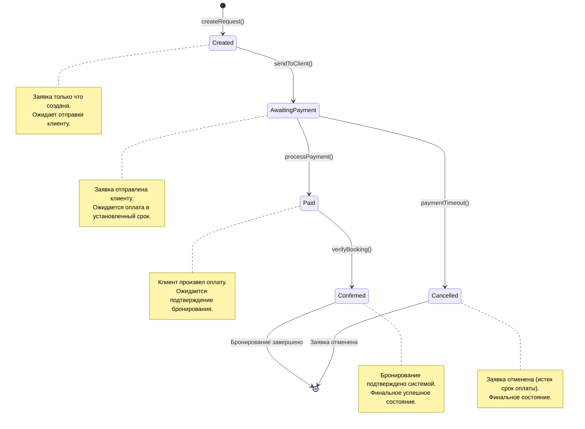

# Диаграмма состояний: Система бронирования билетов

## Описание состояний

| Состояние | Описание |
|-----------|----------|
| Created | Заявка только что создана |
| AwaitingPayment | Заявка отправлена клиенту для оплаты |
| Paid | Клиент завершил оплату |
| Confirmed | Система подтвердила успешное бронирование |
| Cancelled | Заявка была отменена |

## Правила переходов

| Из состояния | В состояние | Событие | Условие |
|--------------|-------------|---------|---------|
| [*] | Created | createRequest() | Создание новой заявки |
| Created | AwaitingPayment | sendToClient() | Отправка клиенту |
| AwaitingPayment | Paid | processPayment() | Клиент произвел оплату |
| AwaitingPayment | Cancelled | paymentTimeout() | Истек срок оплаты |
| Paid | Confirmed | verifyBooking() | Проверка бронирования успешна |
| Confirmed | [*] | - | Финальное состояние |
| Cancelled | [*] | - | Финальное состояние |
