# Диаграмма вариантов использования: Система управления онлайн-курсов

```mermaid
graph TB
    subgraph Actors
        Student((Студент))
        Teacher((Преподаватель))
        Admin((Администратор))
    end

    subgraph "Система управления онлайн-курсами"
        UC1[Регистрация]
        UC1a[Подтверждение email]
        UC2[Авторизация]
        UC3[Просмотр курсов]
        UC4[Запись на курс]
        UC5[Прохождение тестов]
        UC6[Отслеживание прогресса]
        UC7[Оставление отзывов]
        UC8[Создание курса]
        UC9[Редактирование курса]
        UC10[Добавление материалов]
        UC11[Создание тестов]
        UC12[Просмотр статистики успеваемости]
        UC13[Модерация отзывов]
        UC14[Управление учетными записями]
        UC15[Управление категориями курсов]
        UC16[Просмотр аналитики системы]
    end

    %% Связи студента
    Student --> UC1
    Student --> UC2
    Student --> UC3
    Student --> UC4
    Student --> UC5
    Student --> UC6
    Student --> UC7

    %% Связи преподавателя (наследует от студента)
    Teacher --> UC1
    Teacher --> UC2
    Teacher --> UC3
    Teacher --> UC4
    Teacher --> UC5
    Teacher --> UC6
    Teacher --> UC7
    Teacher --> UC8
    Teacher --> UC9
    Teacher --> UC10
    Teacher --> UC11
    Teacher --> UC12
    Teacher --> UC13

    %% Связи администратора (наследует от студента)
    Admin --> UC1
    Admin --> UC2
    Admin --> UC3
    Admin --> UC4
    Admin --> UC5
    Admin --> UC6
    Admin --> UC7
    Admin --> UC14
    Admin --> UC15
    Admin --> UC16

    %% Include связи
    UC1 -.->|<<include>>| UC1a
    UC4 -.->|<<include>>| UC2
    UC5 -.->|<<include>>| UC2
    UC7 -.->|<<include>>| UC2
    UC8 -.->|<<include>>| UC2
    UC9 -.->|<<include>>| UC2

    %% Extend связи
    UC4 -.->|<<extend>>| UC3
    UC7 -.->|<<extend>>| UC5
```

## Описание акторов

| Актор | Описание |
|-------|----------|
| Студент | Пользователь, который обучается на курсах |
| Преподаватель | Пользователь, который создает и ведет курсы. Может выполнять функции студента |
| Администратор | Пользователь с полными правами управления системой. Может выполнять функции студента |

## Описание вариантов использования

### Общие (доступны всем)
| Вариант использования | Описание |
|-----------------------|----------|
| Регистрация | Создание учетной записи в системе |
| Подтверждение email | Верификация email при регистрации |
| Авторизация | Вход в систему |
| Просмотр курсов | Просмотр списка доступных курсов |

### Студент
| Вариант использования | Описание |
|-----------------------|----------|
| Запись на курс | Регистрация на выбранный курс |
| Прохождение тестов | Выполнение тестовых заданий курса |
| Отслеживание прогресса | Просмотр своего прогресса обучения |
| Оставление отзывов | Написание отзыва о курсе |

### Преподаватель
| Вариант использования | Описание |
|-----------------------|----------|
| Создание курса | Создание нового курса |
| Редактирование курса | Изменение параметров курса |
| Добавление материалов | Загрузка учебных материалов |
| Создание тестов | Создание тестовых заданий |
| Просмотр статистики успеваемости | Анализ успеваемости студентов |
| Модерация отзывов | Проверка и управление отзывами |

### Администратор
| Вариант использования | Описание |
|-----------------------|----------|
| Управление учетными записями | CRUD операции с пользователями |
| Управление категориями курсов | Создание и редактирование категорий |
| Просмотр аналитики системы | Просмотр статистики системы |

## Связи

### Include (обязательное включение)
- Регистрация включает Подтверждение email
- Запись на курс включает Авторизация
- Прохождение тестов включает Авторизация
- Оставление отзывов включает Авторизация
- Создание курса включает Авторизация
- Редактирование курса включает Авторизация

### Extend (опциональное расширение)
- Запись на курс расширяет Просмотр курсов
- Оставление отзывов расширяет Прохождение тестов
